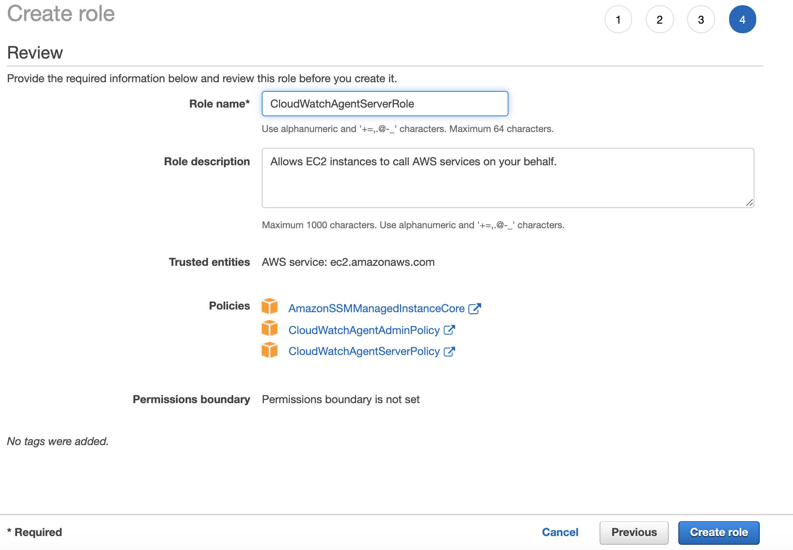
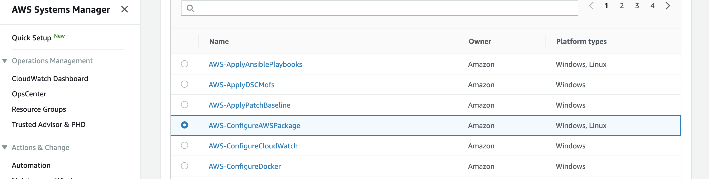

# CloudWatch agent best practices

CloudWatch is an essential monitoring service offered on AWS Console to track the events and health of various resources. In order to monitor the health of compute resources like EC2 OR OnPrem instances, the CloudWatch agent would need to be installed and configured. The latest [CloudWatch agent](https://docs.aws.amazon.com/AmazonCloudWatch/latest/monitoring/Install-CloudWatch-Agent.html) offers unified functionality of exporting both the logs and metrics from the compute resources to the CloudWatch service.

It is a recommended best practice to install CloudWatch Agent on the compute resources spawned for various Operating Systems in order to export logs and desired metrics to CloudWatch service.

This document will guide the user through the series of steps to install CloudWatch agent on EC2 and OnPrem compute instances running Windows OR Linux Operating System and review the exported logs and metrics on CloudWatch.
Though there are multiple methods to installCloudWatch agent (using SSM / manually via command line / using AWS CloudFormation), we will follow the installation using SSM.

## Pre-Requisites

A running EC2 instance:
It is recommended to install AWS Systems Manager agent on the desired compute instances and associate an IAM role with **AmazonEC2RoleforSSM** policy.Once configured, please ensure the instances are visible under the Systems Manager Registered Instances. For more information on procedure to install AWS Systems Manager agent, please follow this link: [About AWS Systems Manager Agent](https://docs.aws.amazon.com/systems-manager/latest/userguide/prereqs-ssm-agent.html)

**Note:** Ensure the SSM Agent is running and with version 2.2.93.0 or later.

Example of EC2 running Amazon Linux2 AMI:

Linux Command(s):
```console
sudo systemctl status amazon-ssm-agent
rpm -qa amazon-ssm-agent
```

List of instances registered under System Manager, Managed Instances:
<kbd></kbd>

Registered OnPrem Instance:
<kbd></kbd>

## Quick Overview of Installation Steps using SSM:

1. Create IAM Role for the EC2 to access CloudWatch Logs and AWS Systems Manager (SSM) System Parameter Store
2. Attach the IAM Role to the EC2 instance(s)
3. Download and install CloudWatch Agent using AWS Systems Manager
4. Create configuration file for the CloudWatch agent and store it in SSM Parameter Store **
5. Start CloudWatch agent using AWS Systems Manager
6. Access CloudWatch console and monitor the Logs and Metrics


** **Note**: All the steps, except Step 4, are similar for the Linux and Windows based EC2 instances.

### Other ways to install CloudWatch Agent

If you want to install CloudWatch Agent with a different method, please follow one of the below links:

* [Installing the CloudWatch Agent using the Command Line](#Installing-the-CloudWatch-Agent-using-the-Command-Line)
* [Installing the CloudWatch Agent using AWS CloudFormation](#Installing-the-CloudWatch-Agent-using-the-CloudFormation)

Please feel free to experiment on the different methods mentioned above.

## Step By Step Installation of CloudWatch Agent on EC2 and OnPrem Instances:

### Step 1. Create IAM Role for EC2 to access CloudWatch and AWS SSM Parameter Store:

Create IAM role with name CloudWatchAgentServerRole (or another name that you prefer) for EC2 and select following policies:
  * **CloudWatchAgentServerPolicy** for access to CloudWatch service
  * **AmazonSSMManagedInstanceCore** for access to AWS Systems Manager
  * **CloudWatchAgentAdminPolicy** for access to Parameter Store

Select the IAM service, Click on Roles on the Left side, Click Create Role, Make policies selection as shown below:
<kbd></kbd>

Give the Role name and create role:
<kbd></kbd>


### Step 2. Attach the IAM Role to the EC2 instance(s):

Attach the IAM role created above to the desired EC2 instance:
  * Open the Amazon EC2 console and select the instance, choose Actions, Instance Settings, Attach/Replace IAM role
  * Select the IAM role (CloudWatchAgentServerRole) to attach to your instance, and choose Apply

Selecting instance and Attach IAM Role:
<kbd></kbd>

Selecting the Role Name created above:
<kbd></kbd>


### Step 3. Download and install CloudWatch Agent using AWS Systems Manager

Open AWS Systems Manager Console and follow the below steps:
  * Select Managed Instances, then on right side, Select Action dropdown list & select **Run Command**

<kbd></kbd>

  * In the Command document list, choose **AWS-ConfigureAWSPackage** (applicable for Windows / Linux)

<kbd></kbd>

  * Scroll Down to select **Install** as Action, provide a name **AmazonCloudWatchAgent**
  * Select **latest** for the Version and desired instances under Targets by selecting **Choose instances manually**
  * Choose an existing S3 bucket to store the output and Click **Run**
  * Check the command status by clicking button next to Instance name and select **View output**. Systems Manager should show that the agent was successfully installed.

Run Command issued and in progress:
<kbd></kbd>

Run Command Status showing success and summarized output:
<kbd></kbd>

Run Command Output to check the complete output:
<kbd></kbd>


### Step 4. Create configuration file for the CloudWatch agent and store it in SSM Parameter Store

Login into the desired EC2 Linux instance to create a configuration file via Command Line by running config-wizard :

Linux Command(s):
```console
sudo systemctl status amazon-ssm-agent
cd /opt/aws/amazon-cloudwatch-agent/bin
ls amazon-cloudwatch-agent-config-wizard
sudo ./amazon-cloudwatch-agent-config-wizard
```

Running Configuration Wizard on Linux Instance:
<kbd></kbd>

Running Configuration Wizard on Windows Instance in Powershell:
<kbd></kbd>

The json file created from the config-wizard is stored at: /opt/aws/amazon-cloudwatch-agent/bin/config.json
On running the config-wizard, answer the questions asked to configure the exporting of desired metrics and logs. At the end, save this configuration on the Systems Parameter Store named as AmazonCloudWatch-linux.

Completion of Configuration Wizard output:
<kbd></kbd>

Later login to the SSM Parameter Store and check the new entry created and the desired configuration file in JSON format.

<kbd></kbd>


### Step 5. Start CloudWatch agent using AWS Systems Manager

As per the steps listed in Step 3 above, start the CloudWatch agent using SSM Run Command by selecting **AmazonCloudWatch-ManageAgent** configuration document and configuration location to be the Parameter Store entry name along with a Bucket Name to store the command output.

<kbd></kbd>

Lastly, check the status of the CloudWatch agent service using command:

Linux Command(s):
```console
sudo systemctl status amamzon-cloudwatch-agent
```
Windows Command(s):
<kbd></kbd>


### Step 6. Access CloudWatch console and monitor the Logs and Metrics

**Note**: The metrics and logs can take up to 5 minutes to be displayed on CloudWatch, depending upon the configuration parameter entered in earlier step.

Access the CloudWatch console and check the Metrics:

Select the "CWAgent" from the Metrics Window as shown below:
<kbd></kbd>

Browse various metric and select them to be displayed:
<kbd></kbd>

Access the CloudWatch console and check the Logs:

<kbd></kbd>


## Cleanup

On the completion of the lab, please feel free to stop the CloudWatch agent on the EC2 instances to avoid any additional charges. Additionally, may terminate the EC2 instances that are launched specifically for this lab.

## References

* [CWAgent Onprem](https://docs.aws.amazon.com/AmazonCloudWatch/latest/monitoring/install-CloudWatch-Agent-on-premise.html
)

* [CWAgent on EC2](https://docs.aws.amazon.com/AmazonCloudWatch/latest/monitoring/Install-CloudWatch-Agent.html
)
* [Pricing and Costs for CloudWatch](https://aws.amazon.com/cloudwatch/pricing/
)
* [Granularity and Retention period](https://aws.amazon.com/cloudwatch/faqs/
)
* [Service Limits](https://docs.aws.amazon.com/AmazonCloudWatch/latest/monitoring/cloudwatch_limits.html
)
* [Extra steps for Onprem](https://docs.aws.amazon.com/AmazonCloudWatch/latest/monitoring/install-CloudWatch-Agent-on-premise.html
)

---
## APPENDIX


### Granularity and Retention Period
Depending on the granularity of the metric, the retention time may vary. As of October 2019, these are the retention periods:

* Data points with a period of less than 60 seconds are available for 3 hours. These data points are high-resolution custom metrics.
* Data points with a period of 60 seconds (1 minute) are available for 15 days
* Data points with a period of 300 seconds (5 minute) are available for 63 days 
* Data points with a period of 3600 seconds (1 hour) are available for 455 days (15 months)

For current values, please verify on this [link](https://aws.amazon.com/cloudwatch/faqs/).

---
### Installing the CloudWatch Agent using the Command Line

Following are the steps to install CloudWatch Agent using command line on the instance. ie. The shell commands for Linux and PowerShell commands for Windows. Primarily following steps:
1. Download the files and verify the integrity
2. Installation of CloudWatchAgent
3. Configure the CloudWatchAgent and Start the CloudWatchAgent

#### 1. Download and Verification of the files:

**EC2 / Onprem: Linux:**

Download the CloudWatch Agent RPM:
```
wget https://s3.amazonaws.com/amazoncloudwatch-agent/amazon_linux/amd64/latest/amazon-cloudwatch-agent.rpm
```

Verify:
(a) Download, import public GPG key & verify itself first:
```
wget https://s3.amazonaws.com/amazoncloudwatch-agent/assets/amazon-cloudwatch-agent.gpg
gpg --import amazon-cloudwatch-agent.gpg => note the <key-value>
gpg --fingerprint <key-value> => note the fingerprint
```

The key fingerprint string should be equal to the following:
9376 16F3 450B 7D80 6CBD 9725 D581 6730 3B78 9C72

(b) Using GPG key, verify with Downloaded Signature file:
```
wget https://s3.amazonaws.com/amazoncloudwatch-agent/amazon_linux/amd64/latest/amazon-cloudwatch-agent.rpm.sig
gpg --verify amazon-cloudwatch-agent.rpm.sig amazon-cloudwatch-agent.rpm
```
=> should say: Good signature from "Amazon CloudWatch Agent"


**EC2 / OnPrem: Windows:**

Download the CloudWatch Agent MSI:
```
https://s3.amazonaws.com/amazoncloudwatch-agent/windows/amd64/latest/amazon-cloudwatch-agent.msi
```

Verify:
(a) Download, import public GPG key & verify itself first:
Download and install GnuPG for Windows from https://gnupg.org/download/. When installing, include the Shell Extension (GpgEx) option.
You can perform the remaining steps in Windows PowerShell.

```
wget https://s3.amazonaws.com/amazoncloudwatch-agent/assets/amazon-cloudwatch-agent.gpg -OutFile amazon-cloudwatch-agent.gpg
gpg --import amazon-cloudwatch-agent.gpg => note the <key-value>
gpg --fingerprint <key-value>
```

The key fingerprint string should be equal to the following:
9376 16F3 450B 7D80 6CBD 9725 D581 6730 3B78 9C72

(b) Using GPG key, verify with Download Signature file:
```
wget https://s3.amazonaws.com/amazoncloudwatch-agent/windows/amd64/latest/amazon-cloudwatch-agent.msi.sig
gpg --verify amazon-cloudwatch-agent.msi.sig amazon-cloudwatch-agent.msi
```
=> should say: Good signature from "Amazon CloudWatch Agent"


#### 2. Installation of the CloudWatch Agent:

**Linux:**  
```
EC2: sudo rpm -U ./amazon-cloudwatch-agent.rpm  
Onprem: sudo aws configure --profile AmazonCloudWatchAgent => Configure the IAM Role & correct region
```

**Windows:**
```
EC2: msiexec /i amazon-cloudwatch-agent.msi  
OnPrem: aws configure --profile AmazonCloudWatchAgent => Configure the IAM Role & correct region
```

#### 3. Configure and Start the CloudWatch Agent:
The configuration steps are the same as covered in the main section for Linux and Windows. The below steps are used to start the agent:

**Linux:**  
```
EC2: sudo /opt/aws/amazon-cloudwatch-agent/bin/amazon-cloudwatch-agent-ctl -a fetch-config -m ec2 -c file:configuration-file-path -s  
OnPrem: sudo /opt/aws/amazon-cloudwatch-agent/bin/amazon-cloudwatch-agent-ctl -a fetch-config -m onPremise -c file:<configuration-file-path> -s
```

**Windows:**  
```
EC2: ./amazon-cloudwatch-agent-ctl.ps1 -a fetch-config -m ec2 -c file:configuration-file-path -s  
OnPrem: ./amazon-cloudwatch-agent-ctl.ps1 -a fetch-config -m onPremise -c file:configuration-file-path -s
```

---

### Installing the CloudWatch Agent using the CloudFormation

Below are the steps to install and start CloudWatch Agent using CloudFormation.
Pre-Requisites:
1. Ensure that the IAM Role is created.
2. Find the required AMI names to install desired OS

#### Steps for Linux based EC2 Instance:
* Login to the console and login to the Cloud9 environment
* From the Bash shell, ensure the aws cli commands are working fine by typing: aws --version
* Download the CloudFormation template using below command:

```
curl -O https://raw.githubusercontent.com/awslabs/aws-cloudformation-templates/master/aws/solutions/AmazonCloudWatchAgent/inline/amazon_linux.template
```

* Now depending upon the region, run the below commands using appropriate AMI Name, KeyPair name, IAM Role name:

Example for us-east-2 region:
```
aws cloudformation create-stack --stack-name CFCWAgentLinuxDeploy \
--template-body file:////$PWD/amazon_linux.template \
--parameters \
ParameterKey=KeyName,ParameterValue=<key-name-without-pem-extension> \
ParameterKey=InstanceType,ParameterValue=t2.micro \
ParameterKey=InstanceAMI,ParameterValue=ami-00c03f7f7f2ec15c3 \
ParameterKey=IAMRole,ParameterValue=CloudWatchAgentServerRole \
--capabilities CAPABILITY_IAM
```


#### Steps for Windows based EC2 Instance:
* Login to the console and login to the Cloud9 environment
* From the Bash shell, ensure the aws cli commands are working fine by typing: aws --version
* Download the CloudFormation template using below command:

```
curl -O https://raw.githubusercontent.com/awslabs/aws-cloudformation-templates/master/aws/solutions/AmazonCloudWatchAgent/inline/windows.template
```

* Now depending upon the region, run the below commands using appropriate AMI Name, KeyPair name, IAM Role name:

Example for us-east-2 region:
```
aws cloudformation create-stack --stack-name CFCWAgentWindowsDeploy \
--template-body file:////$PWD/amazon_linux.template \
--parameters \
ParameterKey=KeyName,ParameterValue=<key-name-without-pem-extension> \
ParameterKey=InstanceType,ParameterValue=t2.micro \
ParameterKey=InstanceAMI,ParameterValue=ami-04203dd87d4abd6f6 \
ParameterKey=IAMRole,ParameterValue=CloudWatchAgentServerRole \
--capabilities CAPABILITY_IAM
```
